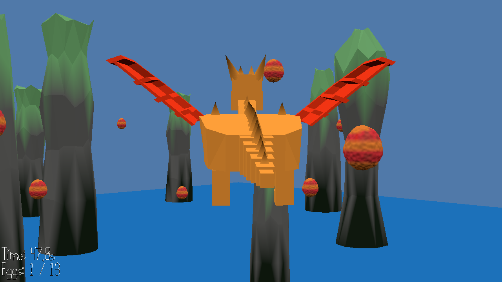

# Dragon Egg Chase

Author: Ryan Lee

Design: Dragon Egg Chase is a game where you play as a dragon that needs to collect all their eggs.
        This game is different from just a normal flying simulator since it adds obstacles and 
        a concrete goal of collecting all the eggs.

Screen Shot:

How To Play:

The goal of this game is to collect all 13 eggs as fast as you can.
If you run into a pillar, you will lose your speed resulting in a large time reduction.
You also slow down when turning.

Controls:
W - Fly Up,
A - Turn Left,
S - Fly Down,
D - Turn Right,

This game was built with [NEST](NEST.md).
